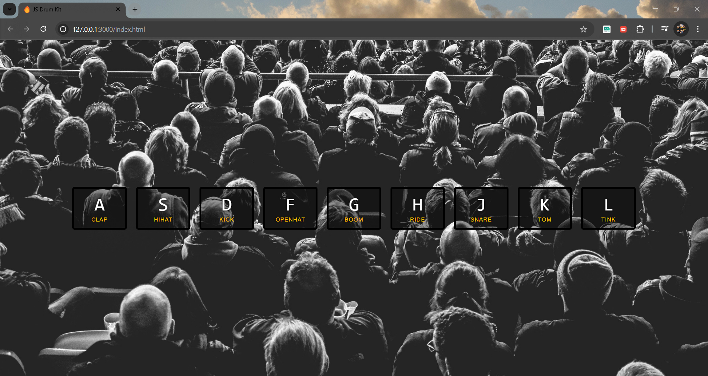
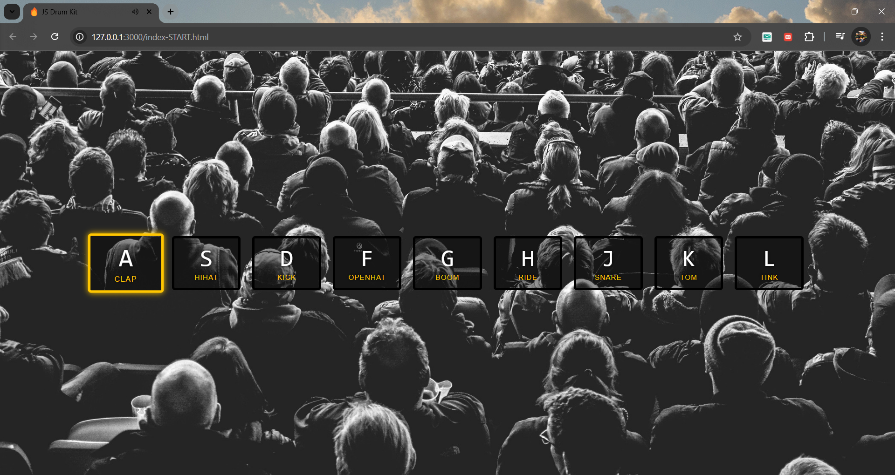

# 🥁 JS Drum Kit

## 📌 Project Description
The **JS Drum Kit** is an interactive web-based drum simulator that allows users to play different drum sounds using their keyboard. Each key corresponds to a unique drum sound, such as a snare, kick, hi-hat, or tom. This project is built using **HTML, CSS, and JavaScript**.

## 🎯 Features
✅ Play drum sounds by pressing keyboard keys  
✅ Smooth and responsive playback  
✅ Visual feedback with animations  
✅ Background image for enhanced UI  
✅ Lightweight and simple UI  

## 🛠️ Technologies Used
- **HTML** → For structuring the drum keys
- **CSS** → For styling and visual effects
- **JavaScript** → For handling key events and playing sounds

## 🚀 How It Works
1. Press a specific key on your keyboard (e.g., `A` for a **clap** sound).
2. JavaScript detects the key press and plays the corresponding sound.
3. A visual effect highlights the key when pressed.
4. The effect disappears after the animation ends.
5. A background image is displayed for a visually appealing interface.

## 📂 Project Structure
```
JS-Drum-Kit/
│── assets/
|── sounds/      # Folder containing all drum sound files
│── index.html  # Main HTML file
│── style.css   # Styling file
│── script.js   # JavaScript file for interactivity
│── README.md   # Project documentation
```

## 📦 Installation & Usage
1. **Clone the repository:**
   ```bash
   git clone https://github.com/your-username/JS-Drum-Kit.git
   ```
2. **Navigate to the project folder:**
   ```bash
   cd JS-Drum-Kit
   ```
3. **Open `index.html` in your browser and start playing!**

## 📸 Screenshots
### 🎹 Drum Kit Interface





## 📜 License
This project is open-source and free to use.

---
**Made with ❤️ using JavaScript!**

